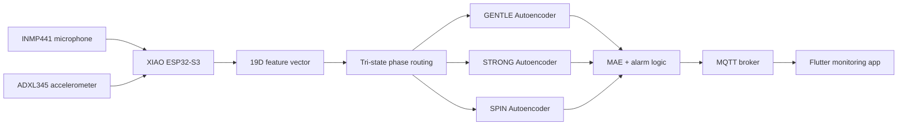

# Thiết kế hệ thống AIoT phát hiện và cảnh báo bất thường cho máy giặt dân dụng sử dụng Autoencoder không giám sát trên thiết bị biên


Hệ thống Edge AI/TinyML giám sát trạng thái máy giặt theo thời gian thực. Thiết bị dùng microphone INMP441 và cảm biến rung ADXL345 để tạo vector đặc trưng 19 chiều, chạy Autoencoder INT8 trực tiếp trên Seeed Studio XIAO ESP32-S3, sau đó gửi trạng thái qua MQTT cho ứng dụng Flutter hiển thị.

## Mục lục

- [Tổng quan](#tổng-quan)
- [Kiến trúc hệ thống](#kiến-trúc-hệ-thống)
- [Cấu trúc mã nguồn](#cấu-trúc-mã-nguồn)
- [Phần cứng](#phần-cứng)
- [Phần mềm cần cài](#phần-mềm-cần-cài)
- [Cấu hình bảo mật](#cấu-hình-bảo-mật)
- [Quy trình sử dụng đầy đủ](#quy-trình-sử-dụng-đầy-đủ)
- [Chạy ứng dụng Flutter](#chạy-ứng-dụng-flutter)
- [Payload MQTT](#payload-mqtt)
- [Kiểm tra chất lượng trước khi push](#kiểm-tra-chất-lượng-trước-khi-push)
- [Xử lý lỗi thường gặp](#xử-lý-lỗi-thường-gặp)

## Tổng quan

Bài toán của dự án là phát hiện bất thường của máy giặt dân dụng bằng mô hình học không giám sát chạy trực tiếp trên vi điều khiển. Thay vì gửi toàn bộ âm thanh/rung động lên cloud, hệ thống chỉ gửi kết quả đã suy luận: trạng thái `OK`, `HIGH`, `ALARM`, giá trị MAE, pha vận hành và các bộ đếm thống kê.

Các điểm chính của bản `fix-v2`:

- Tách bộ source cuối thành các file `final_*`, không phụ thuộc vào file legacy.
- Huấn luyện theo pipeline leakage-free: chia train/validation/test trước augmentation.
- Tích hợp K-Means để tính ngưỡng chuyển pha từ `var_z` trong `final_training.py`.
- Không hardcode Wi-Fi/MQTT credential trong firmware hoặc Flutter app.
- Firmware runtime chạy dual-core:
  - Core 0 xử lý audio I2S, FFT và 13 log-Mel.
  - Core 1 xử lý rung, định tuyến pha, suy luận Autoencoder và publish MQTT.
- Flutter app theo dõi realtime qua MQTT và hiển thị monitor, chart, thống kê.

## Kiến trúc hệ thống



Dữ liệu xử lý theo cửa sổ 1 giây:

| Nhánh | Tín hiệu | Xử lý | Đặc trưng |
|---|---|---|---|
| Audio | INMP441, 8 kHz | FFT 512, hop 256, 30 frame, 13 Mel band | 13 log-Mel |
| Vibration | ADXL345 | RMS và variance theo 3 trục | 6 đặc trưng |
| Fusion | Audio + vibration | Ghép vector | 19 chiều |

Layout vector 19 chiều:

| Index | Ý nghĩa |
|---:|---|
| `0..12` | 13 đặc trưng log-Mel audio |
| `13` | `rms_x` |
| `14` | `var_x` |
| `15` | `rms_y` |
| `16` | `var_y` |
| `17` | `rms_z` |
| `18` | `var_z` |

`var_z` được dùng để định tuyến cửa sổ hiện tại sang một trong ba pha:

- `GENTLE`: giặt nhẹ/thấm.
- `STRONG`: giặt chính.
- `SPIN`: vắt tốc độ cao.

## Cấu trúc mã nguồn

Các entry-point chính của nhánh này:

```text
TinyML-Anomaly-Detection/
|-- .env.example
|-- .gitignore
|-- README.md
|-- final_data_collection.py
|-- final_feature_extraction.py
|-- final_training.py
|-- dataCollection/
|   `-- final_data_collection.ino
|-- firmware_v11/
|   |-- env_config.example.h
|   |-- final_firmware.ino
|   `-- model_data_final.h
|-- tinyml_app/
|   |-- lib/
|   |   |-- app_config.example.dart
|   |   |-- main.dart
|   |   |-- mqtt_factory.dart
|   |   `-- mqtt_factory_web.dart
|   |-- pubspec.yaml
|   `-- ...
`-- tools/
    `-- generate_env_config.py
```

Ý nghĩa từng file:

| File/thư mục | Vai trò |
|---|---|
| `dataCollection/final_data_collection.ino` | Firmware thu dữ liệu thô từ INMP441 và ADXL345 qua Serial |
| `final_data_collection.py` | Script Python nhận stream Serial và lưu thành `.wav` + `.csv` |
| `final_feature_extraction.py` | Trích xuất 19 đặc trưng từ dữ liệu đã thu |
| `final_training.py` | Huấn luyện 3 Autoencoder, đánh giá hold-out, xuất header INT8 |
| `firmware_v11/final_firmware.ino` | Firmware runtime chạy Edge AI và gửi MQTT |
| `firmware_v11/model_data_final.h` | Header chứa scaler, ngưỡng và 3 model TFLite INT8 |
| `tools/generate_env_config.py` | Sinh config local cho firmware và Flutter từ `.env` |
| `tinyml_app/` | Ứng dụng Flutter monitor realtime |

## Phần cứng

| Thành phần | Thiết bị |
|---|---|
| MCU | Seeed Studio XIAO ESP32-S3 |
| Microphone | INMP441 I2S |
| Accelerometer | ADXL345 I2C |
| Kết nối mạng | Wi-Fi 2.4 GHz |
| Dashboard | Flutter Web/App |

Kết nối chân:

| Module | Tín hiệu | XIAO ESP32-S3 |
|---|---|---|
| INMP441 | WS/LRCLK | GPIO6 |
| INMP441 | BCLK/SCK | GPIO43 |
| INMP441 | DIN/SD | GPIO44 |
| INMP441 | VCC | 3V3 |
| INMP441 | GND | GND |
| ADXL345 | SDA | GPIO5 |
| ADXL345 | SCL | GPIO4 |
| ADXL345 | VCC | 3V3 |
| ADXL345 | GND | GND |

Gợi ý lắp đặt:

- Gắn cảm biến cố định lên thân máy giặt, tránh dây lỏng gây rung giả.
- Không để microphone chạm trực tiếp vào vỏ kim loại.
- Giữ hướng gắn ADXL345 ổn định giữa các lần thu dữ liệu và chạy demo.
- Nên cấp nguồn ổn định cho ESP32-S3 khi chạy inference và Wi-Fi cùng lúc.

## Phần mềm cần cài

### Python

Khuyến nghị dùng Python 3.10 hoặc 3.11. TensorFlow/TensorFlow Model Optimization có thể không ổn định trên một số bản Python mới hơn.

Các thư viện chính:

```powershell
pip install numpy pandas pyserial scikit-learn tensorflow tensorflow-model-optimization
```

Nếu cần chạy đầy đủ pipeline có vẽ biểu đồ hoặc notebook riêng, có thể cài thêm:

```powershell
pip install matplotlib seaborn
```

### Arduino IDE

Cần Arduino IDE 2.x hoặc môi trường tương đương có ESP32 board support.

Thư viện dùng trong firmware:

- `WiFi`
- `WiFiClientSecure`
- `Wire`
- `PubSubClient`
- `ArduinoJson`
- `TensorFlowLite_ESP32`
- `esp_dsp`

Board:

```text
Seeed Studio XIAO ESP32S3
```

Serial baud:

```text
921600
```

### Flutter

Ứng dụng Flutter yêu cầu Flutter SDK và Chrome nếu chạy web:

```powershell
flutter doctor
```

Dependency chính nằm trong `tinyml_app/pubspec.yaml`:

- `mqtt_client`
- `firebase_core`
- `cloud_firestore`
- `flutter_local_notifications`
- `fl_chart`
- `intl`

## Cấu hình bảo mật

Credential không được commit vào Git. Nhánh này dùng `.env` local để sinh file config cho firmware và Flutter.

### Bước 1: tạo file `.env`

```powershell
Copy-Item .env.example .env
```

Điền nội dung thật vào `.env`:

```env
WIFI_SSID=your_wifi_ssid
WIFI_PASSWORD=your_wifi_password
MQTT_HOST=xxxxxxxxxxxxxxxxxxxxxxxxxxxxxxxx.s1.eu.hivemq.cloud
MQTT_PORT=8883
MQTT_USERNAME=your_mqtt_username
MQTT_PASSWORD=your_mqtt_password
MQTT_TOPIC=tinyml/quang_wm_2026/status
```

### Bước 2: sinh config local

```powershell
python tools/generate_env_config.py
```

Lệnh trên tạo:

```text
firmware_v11/env_config.h
tinyml_app/lib/app_config.dart
```

Hai file này bị ignore bởi Git và không được push.

Nếu muốn chỉ định đường dẫn khác:

```powershell
python tools/generate_env_config.py `
  --env .env `
  --firmware-out firmware_v11/env_config.h `
  --flutter-out tinyml_app/lib/app_config.dart
```

## Quy trình sử dụng đầy đủ

Quy trình chuẩn gồm 5 bước:

1. Flash firmware thu dữ liệu.
2. Thu dữ liệu `.wav` và `.csv`.
3. Trích xuất feature thành `train_features_v6.csv`.
4. Huấn luyện và xuất `model_data_final.h`.
5. Flash firmware runtime và mở app Flutter.

### Bước 1: flash firmware thu dữ liệu

Mở Arduino IDE và nạp:

```text
dataCollection/final_data_collection.ino
```

Thiết lập:

```text
Board: Seeed Studio XIAO ESP32S3
Baud: 921600
```

Sau khi nạp, kiểm tra Serial Monitor để chắc chắn cảm biến hoạt động.

### Bước 2: thu dữ liệu

Tạo thư mục dữ liệu:

```powershell
New-Item -ItemType Directory -Force dataset_v6/normal
```

Chạy script thu dữ liệu:

```powershell
python final_data_collection.py --port COM5 --out dataset_v6/normal --duration 5
```

Tham số:

| Tham số | Mặc định | Ý nghĩa |
|---|---:|---|
| `--port` | bắt buộc | Cổng serial của ESP32-S3, ví dụ `COM5` |
| `--baud` | `921600` | Baud rate |
| `--out` | `dataset_v6/normal` | Thư mục lưu dữ liệu |
| `--duration` | `5` | Số giây cho mỗi sample |
| `--start-index` | `1` | Index bắt đầu đặt tên file |
| `--count` | `0` | Số sample cần thu, `0` nghĩa là chạy đến khi Ctrl+C |

Mỗi sample tạo ra:

```text
sample_0001.wav
sample_0001.csv
sample_0002.wav
sample_0002.csv
...
```

File `.wav` chứa audio mono 16-bit ở 8 kHz. File `.csv` chứa dữ liệu gia tốc `X`, `Y`, `Z` theo đơn vị g.

### Bước 3: trích xuất đặc trưng

Chạy:

```powershell
python final_feature_extraction.py --data-dir dataset_v6/normal --out train_features_v6.csv
```

Smoke test với một file đầu tiên:

```powershell
python final_feature_extraction.py --data-dir dataset_v6/normal --out tmp_features_check.csv --limit-files 1
```

Đầu ra là CSV có 19 cột kèm header (`mfe_0..mfe_12`, `rms_x`, `var_x`, `rms_y`, `var_y`, `rms_z`, `var_z`), đúng layout đã mô tả ở phần [Kiến trúc hệ thống](#kiến-trúc-hệ-thống).

Lưu ý:

- Mỗi file 5 giây được tách thành 5 cửa sổ 1 giây.
- Mỗi cửa sổ dùng 8000 mẫu audio và 1000 dòng rung.
- Nếu file quá ngắn hoặc thiếu cặp `.wav/.csv`, script sẽ bỏ qua và báo lý do.

### Bước 4: huấn luyện model

Chạy pipeline mặc định:

```powershell
python final_training.py `
  --csv train_features_v6.csv `
  --out-header firmware_v11/model_data_final.h `
  --results results_final.json
```

Các giá trị ngưỡng trong script được cố định để khớp hoàn toàn với `latex_v2`:

| Giá trị | Con số | Ý nghĩa |
|---|---:|---|
| `VAR_Z_THR1` | `0.105845` | Ranh giới `GENTLE/STRONG`, tính bằng K-Means trên cột `var_z` của 14.000 vector đặc trưng gốc |
| `VAR_Z_THR2` | `0.386260` | Ranh giới `STRONG/SPIN`, tính bằng K-Means trên cột `var_z` của 14.000 vector đặc trưng gốc |
| `THRESHOLD_GENTLE` | tự tính khi train | Ngưỡng MAE tối ưu theo F1, có chặn dưới bởi percentile normal như `training_v2.py` |
| `THRESHOLD_STRONG` | tự tính khi train | Ngưỡng MAE tối ưu theo F1, có chặn dưới bởi percentile normal như `training_v2.py` |
| `THRESHOLD_SPIN` | tự tính khi train | Ngưỡng MAE tối ưu theo F1, có chặn dưới bởi percentile normal như `training_v2.py` |

`final_training.py` không cung cấp thêm các chế độ chọn ngưỡng khác vì mục tiêu của nhánh này là tái lập đúng bản đã chốt trong `latex_v2`, không mở rộng thêm thí nghiệm ngoài báo cáo.

Đầu ra:

```text
firmware_v11/model_data_final.h
results_final.json
```

`model_data_final.h` chứa:

- `VAR_Z_THR1`: ranh giới K-Means giữa cụm `GENTLE` và `STRONG`
- `VAR_Z_THR2`: ranh giới K-Means giữa cụm `STRONG` và `SPIN`
- `THRESHOLD_GENTLE`
- `THRESHOLD_STRONG`
- `THRESHOLD_SPIN`
- scaler vibration cho từng pha
- 3 mảng model TFLite INT8

Ngưỡng MAE hiện tại trong app và header:

| Phase | Threshold |
|---|---:|
| GENTLE | `0.0469` |
| STRONG | `0.1077` |
| SPIN | `0.0989` |

### Bước 5: flash firmware runtime

Trước khi flash, cần có:

```text
firmware_v11/model_data_final.h
firmware_v11/env_config.h
```

Nếu chưa có `env_config.h`, chạy:

```powershell
python tools/generate_env_config.py
```

Mở Arduino IDE và nạp:

```text
firmware_v11/final_firmware.ino
```

Serial Monitor nên hiển thị dạng:

```text
=== BOOT FINAL (True Parallel Dual-Core) ===
  Core 0: AUDIO (I2S + FFT)
  Core 1: VIB (ADXL@1ms, prio=15) + AI (prio=5)
[WIFI] Connecting...
[WIFI] Connected
[ADXL] OK (0xE5)
[I2S] OK
[VIB] Ready
[AI] Ready, waiting for both queues...
=== READY FINAL ===
[MQTT] Connecting to HiveMQ Cloud...OK
```

Runtime log chính:

```text
[RAW] mel: ... | rms: x=... y=... z=... | var: x=... y=... z=...
[OK   ][GENTLE] MAE:0.0292 (f:0.0295) THR:0.0469 consec:0 t:7839us | wins:2 g:2 st:0 sp:0
```

Ý nghĩa:

| Trường | Ý nghĩa |
|---|---|
| `OK/HIGH/ALARM` | Trạng thái sau so sánh ngưỡng và bộ lọc cửa sổ |
| `GENTLE/STRONG/SPIN` | Pha được định tuyến theo `var_z` |
| `MAE` | Sai số tái tạo miền INT8 dùng để cảnh báo |
| `f` | MAE float tham khảo |
| `THR` | Ngưỡng MAE của pha hiện tại |
| `consec` | Số cửa sổ HIGH liên tiếp |
| `t` | Thời gian inference microsecond |
| `wins` | Tổng số cửa sổ đã xử lý |

Logic alarm:

```text
ALARM_WINDOW = 10
ALARM_ENTER_THR = 5
ALARM_EXIT_THR = 1
```

Nghĩa là:

- Vào `ALARM` khi có ít nhất `5/10` cửa sổ gần nhất vượt ngưỡng.
- Thoát `ALARM` khi còn nhiều nhất `1/10` cửa sổ gần nhất vượt ngưỡng.

## Chạy ứng dụng Flutter

### Chuẩn bị config app

Nếu chưa sinh `tinyml_app/lib/app_config.dart`, chạy:

```powershell
python tools/generate_env_config.py
```

### Chạy trên Chrome

```powershell
cd tinyml_app
C:\Users\Admin\flutter\bin\flutter.bat pub get
C:\Users\Admin\flutter\bin\flutter.bat run -d chrome
```

Ghi chú cho Flutter Web: `tinyml_app/lib/mqtt_factory_web.dart` dùng WebSocket Secure với URL `wss://<MQTT_HOST>/mqtt` và port `8884`, đúng với cách HiveMQ Cloud thường expose MQTT over WebSocket. Firmware ESP32-S3 vẫn dùng MQTT TLS port `8883`.

Nếu Flutter nằm trong PATH:

```powershell
cd tinyml_app
flutter pub get
flutter run -d chrome
```

### Build web release

```powershell
cd tinyml_app
flutter build web
```

Output nằm trong:

```text
tinyml_app/build/web
```

### Các màn hình chính

| Tab | Chức năng |
|---|---|
| Monitor | Trạng thái hiện tại, pha giặt, lịch sử sự kiện |
| MAE Chart | Đồ thị MAE realtime, các đường ngưỡng theo pha |
| Thống kê | Tổng số window, số alarm, uptime, phân bố trạng thái, thông số kỹ thuật |

## Payload MQTT

Firmware publish JSON lên topic trong `MQTT_TOPIC`.

Ví dụ payload:

```json
{
  "state": "OK",
  "mae": 0.0292,
  "is_alarm": false,
  "win": 12,
  "consec": 0,
  "mode": "GENTLE"
}
```

Ý nghĩa:

| Field | Kiểu | Ý nghĩa |
|---|---|---|
| `state` | string | `OK`, `HIGH`, hoặc `ALARM` |
| `mae` | number | MAE sau suy luận INT8 |
| `is_alarm` | boolean | Trạng thái alarm đã qua bộ lọc 10 cửa sổ |
| `win` | number | Số thứ tự cửa sổ |
| `consec` | number | Số cửa sổ HIGH trong cửa sổ trượt hoặc bộ đếm liên quan |
| `mode` | string | `GENTLE`, `STRONG`, hoặc `SPIN` |

Ví dụ gửi payload test từ một script hoặc MQTT client:

```json
{"state":"HIGH","mae":0.064,"is_alarm":false,"win":3,"consec":2,"mode":"GENTLE"}
```

Để app chuyển sang `ALARM`, cần gửi chuỗi payload thỏa logic `>=5/10` cửa sổ bất thường, ví dụ:

```json
{"state":"ALARM","mae":0.082,"is_alarm":true,"win":6,"consec":5,"mode":"GENTLE"}
```

## Kiểm tra chất lượng trước khi push

Chạy kiểm tra Python:

```powershell
python -m py_compile final_data_collection.py final_feature_extraction.py final_training.py tools\generate_env_config.py
```

Chạy kiểm tra Flutter:

```powershell
cd tinyml_app
C:\Users\Admin\flutter\bin\flutter.bat analyze
```

Kiểm tra Git trước khi commit:

```powershell
git status --short
git diff --check
```

Không dùng:

```powershell
git add .
```

Nên stage rõ file:

```powershell
git add README.md final_training.py firmware_v11/final_firmware.ino
```

## Xử lý lỗi thường gặp

### Thiếu `env_config.h`

Lỗi:

```text
env_config.h: No such file or directory
```

Cách xử lý:

```powershell
Copy-Item .env.example .env
notepad .env
python tools/generate_env_config.py
```

### Thiếu `app_config.dart`

Lỗi Flutter:

```text
Error: Error when reading 'lib/app_config.dart'
```

Cách xử lý:

```powershell
python tools/generate_env_config.py
```

### App không nhận MQTT

Kiểm tra:

- `MQTT_HOST`, `MQTT_PORT`, `MQTT_USERNAME`, `MQTT_PASSWORD` trong `.env`.
- Firmware và Flutter có cùng `MQTT_TOPIC`.
- HiveMQ Cloud cho phép WebSocket/TLS nếu chạy Flutter Web.
- ESP32-S3 đã kết nối Wi-Fi và Serial có dòng `[MQTT] Connecting...OK`.

### Serial không có dữ liệu

Kiểm tra:

- Đúng cổng COM.
- Đúng baud `921600`.
- Firmware collection đã được flash, không phải firmware runtime.
- INMP441 và ADXL345 nối đúng chân.

### ADXL345 không nhận

Serial có thể báo:

```text
[ADXL] WARN id=0x00
```

Kiểm tra:

- SDA/SCL đúng GPIO5/GPIO4.
- Module dùng nguồn 3V3.
- Địa chỉ I2C là `0x53`.
- Dây GND chung với ESP32-S3.

### TensorFlow không cài được

Khuyến nghị:

- Dùng Python 3.10 hoặc 3.11.
- Tạo virtual environment riêng.
- Nếu Windows gặp lỗi TensorFlow, cân nhắc chạy training trên WSL2, Colab hoặc Kaggle.

## Ghi chú về dữ liệu và tài liệu

Nhánh này cố ý không chứa:

- `latex/`
- `latex_v2/`
- `slides/`
- dataset thu thập
- file `.h5`
- biểu đồ `.png`
- video demo
- file `.env`
- `firmware_v11/env_config.h`
- `tinyml_app/lib/app_config.dart`

Các file trên là dữ liệu cục bộ hoặc artifact sinh ra trong quá trình làm đồ án, không phải source code cần publish.

## Tác giả

Quách Ngọc Quang<br>
Đề tài: Thiết kế hệ thống AIoT phát hiện và cảnh báo bất thường cho máy giặt dân dụng sử dụng Autoencoder không giám sát trên thiết bị biên.

## Giảng viên hướng dẫn

Cán bộ hướng dẫn: TS. Nguyễn Kiêm Hùng

Cán bộ đồng hướng dẫn: TS. Mai Linh

