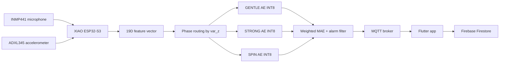

# TinyML Washing Machine Anomaly Detection


Source code cuối cho đồ án:

> **Thiết kế hệ thống AIoT phát hiện và cảnh báo bất thường cho máy giặt dân dụng sử dụng Autoencoder không giám sát trên thiết bị biên**

Hệ thống thu đồng thời âm thanh từ microphone INMP441 và rung động từ cảm biến ADXL345, trích xuất vector đặc trưng 19 chiều, định tuyến theo ba pha vận hành `GENTLE`, `STRONG`, `SPIN`, sau đó chạy Autoencoder INT8 trực tiếp trên Seeed Studio XIAO ESP32-S3. Kết quả suy luận được gửi qua MQTT để ứng dụng Flutter hiển thị trạng thái, lịch sử cảnh báo và đồ thị MAE gần thời gian thực.

## Mục lục

- [Tổng quan](#tổng-quan)
- [Kết quả final](#kết-quả-final)
- [Kiến trúc hệ thống](#kiến-trúc-hệ-thống)
- [Cấu trúc mã nguồn](#cấu-trúc-mã-nguồn)
- [Phần cứng](#phần-cứng)
- [Phần mềm cần cài](#phần-mềm-cần-cài)
- [Cấu hình bảo mật](#cấu-hình-bảo-mật)
- [Quy trình tái lập](#quy-trình-tái-lập)
- [Firmware runtime](#firmware-runtime)
- [Ứng dụng Flutter](#ứng-dụng-flutter)
- [Payload MQTT](#payload-mqtt)
- [Kiểm tra trước khi nộp hoặc push](#kiểm-tra-trước-khi-nộp-hoặc-push)
- [Lỗi thường gặp](#lỗi-thường-gặp)
- [Ghi chú artifact](#ghi-chú-artifact)

## Tổng quan

Bài toán của dự án là phát hiện bất thường trên máy giặt dân dụng trong điều kiện thiếu dữ liệu lỗi có nhãn. Hệ thống dùng học không giám sát: Autoencoder học phân phối dữ liệu bình thường, sau đó phát hiện bất thường bằng sai số tái tạo MAE.

Các quyết định thiết kế chính:

- Xử lý tại biên, không truyền liên tục dữ liệu âm thanh hoặc rung động thô lên cloud.
- Dùng đặc trưng đa cảm biến: 13 log-Mel audio + 6 đặc trưng rung động.
- Tách ba mô hình Autoencoder theo pha vận hành để giảm nhầm lẫn giữa chuyển pha bình thường và bất thường thật.
- Lượng tử hóa INT8 để chạy bằng TensorFlow Lite for Microcontrollers trên ESP32-S3.
- Gửi kết quả qua MQTT, lưu lịch sử bằng Firebase Firestore và hiển thị bằng Flutter.

## Kết quả final

Kết quả đánh giá offline trên tập hold-out của phiên bản final:

| Pha | Threshold MAE | F1-Score | Precision | Recall | AUC |
|---|---:|---:|---:|---:|---:|
| `GENTLE` | `0.0468946621` | `0.9986` | `0.9973` | `1.0000` | `1.0000` |
| `STRONG` | `0.1076632291` | `0.9821` | `0.9735` | `0.9910` | `0.9888` |
| `SPIN` | `0.0989401191` | `0.9707` | `0.9748` | `0.9667` | `0.9917` |

Các thông số triển khai:

| Nhóm | Giá trị |
|---|---:|
| Vector đặc trưng | 19 chiều |
| Số mô hình | 3 Autoencoder INT8 |
| Tổng dung lượng model | khoảng 95.3 KB |
| Độ trễ suy luận trung bình | khoảng 6.4 ms |
| Firmware hoàn chỉnh | khoảng 1.20 MB Flash |
| Biến global/static RAM | khoảng 62 KB |
| Tần suất publish MQTT | tối đa 1 Hz hoặc khi đổi trạng thái |

Lưu ý diễn giải: tập hold-out được dùng trong quy trình kiểm chứng offline và hiệu chỉnh ngưỡng của phiên bản final; các chỉ số trên không nên diễn giải như một benchmark độc lập tuyệt đối trên thiết bị/máy giặt khác.

## Kiến trúc hệ thống



Mỗi cửa sổ xử lý dài 1 giây:

| Nhánh | Nguồn | Xử lý | Đầu ra |
|---|---|---|---|
| Audio | INMP441, 8 kHz | FFT 512, hop 256, 30 frame, 13 Mel band | 13 log-Mel |
| Rung động | ADXL345 | RMS và variance trên 3 trục | 6 đặc trưng |
| Hợp nhất | Audio + rung động | Ghép vector | 19 đặc trưng |

Layout vector 19 chiều:

| Index | Đặc trưng |
|---:|---|
| `0..12` | `mfe_0..mfe_12` |
| `13` | `rms_x` |
| `14` | `var_x` |
| `15` | `rms_y` |
| `16` | `var_y` |
| `17` | `rms_z` |
| `18` | `var_z` |

Định tuyến pha dùng `var_z`:

| Điều kiện | Pha |
|---|---|
| `var_z < 0.105845` | `GENTLE` |
| `0.105845 <= var_z < 0.386260` | `STRONG` |
| `var_z >= 0.386260` | `SPIN` |

Hai ngưỡng định tuyến trên được tính bằng K-Means 3 cụm trên `var_z` của 14,000 vector đặc trưng raw và được cố định để tái lập đúng bản final.

## Cấu trúc mã nguồn

```text
TinyML-Anomaly-Detection/
|-- .env.example
|-- README.md
|-- final_data_collection.py
|-- final_feature_extraction.py
|-- final_training.py
|-- dataCollection/
|   `-- final_data_collection.ino
|-- firmware_v11/
|   |-- env_config.example.h
|   |-- final_firmware.ino
|   `-- model_data_final.h
|-- tinyml_app/
|   |-- lib/
|   |   |-- app_config.example.dart
|   |   |-- firebase_options.dart
|   |   |-- main.dart
|   |   |-- mqtt_factory.dart
|   |   `-- mqtt_factory_web.dart
|   |-- pubspec.yaml
|   `-- ...
`-- tools/
    `-- generate_env_config.py
```

| File/thư mục | Vai trò |
|---|---|
| `dataCollection/final_data_collection.ino` | Firmware thu dữ liệu raw từ INMP441 và ADXL345 qua Serial |
| `final_data_collection.py` | Nhận stream Serial và lưu mỗi mẫu thành `.wav` + `.csv` |
| `final_feature_extraction.py` | Trích xuất CSV đặc trưng 19 chiều từ dữ liệu đã thu |
| `final_training.py` | Huấn luyện ba Autoencoder, lượng tử hóa INT8, xuất header final |
| `firmware_v11/final_firmware.ino` | Firmware runtime chạy suy luận TinyML và publish MQTT |
| `firmware_v11/model_data_final.h` | Bundle model/scaler/ngưỡng final cho firmware |
| `tools/generate_env_config.py` | Sinh config local từ `.env` cho firmware và Flutter |
| `tinyml_app/` | Ứng dụng Flutter giám sát trạng thái máy giặt |

## Phần cứng

| Thành phần | Thiết bị |
|---|---|
| MCU | Seeed Studio XIAO ESP32-S3 |
| Microphone | INMP441 I2S |
| Accelerometer | ADXL345 I2C |
| Kết nối | Wi-Fi 2.4 GHz |
| Dashboard | Flutter Web/App |

Kết nối chân:

| Module | Tín hiệu | XIAO ESP32-S3 |
|---|---|---|
| INMP441 | WS/LRCLK | GPIO6 |
| INMP441 | BCLK/SCK | GPIO43 |
| INMP441 | DIN/SD | GPIO44 |
| INMP441 | VCC | 3V3 |
| INMP441 | GND | GND |
| ADXL345 | SDA | GPIO5 |
| ADXL345 | SCL | GPIO4 |
| ADXL345 | VCC | 3V3 |
| ADXL345 | GND | GND |

Khuyến nghị lắp đặt:

- Cố định ADXL345 chắc trên thân máy giặt để tránh dây hoặc module rung tự do.
- Không để microphone chạm trực tiếp vào vỏ kim loại.
- Giữ hướng gắn ADXL345 ổn định giữa lúc thu dữ liệu và lúc chạy demo.
- Cấp nguồn ổn định cho ESP32-S3 khi chạy đồng thời Wi-Fi, I2S và inference.

## Phần mềm cần cài

### Python

Khuyến nghị Python 3.10 hoặc 3.11.

```powershell
pip install numpy pandas pyserial scikit-learn tensorflow tensorflow-model-optimization
```

Nếu cần chạy script phụ để phân tích hoặc vẽ biểu đồ:

```powershell
pip install matplotlib seaborn
```

### Arduino IDE

Yêu cầu:

- Arduino IDE 2.x hoặc môi trường tương đương.
- ESP32 board support.
- Board: `Seeed Studio XIAO ESP32S3`.
- Serial baud: `921600`.

Thư viện chính:

- `WiFi`
- `WiFiClientSecure`
- `Wire`
- `PubSubClient`
- `ArduinoJson`
- `TensorFlowLite_ESP32`
- `esp_dsp`

### Flutter

```powershell
flutter doctor
```

Dependency chính trong `tinyml_app/pubspec.yaml`:

- `mqtt_client`
- `firebase_core`
- `cloud_firestore`
- `flutter_local_notifications`
- `fl_chart`
- `intl`

## Cấu hình bảo mật

Credential thật không được commit. Repository chỉ chứa file mẫu:

```text
.env.example
firmware_v11/env_config.example.h
tinyml_app/lib/app_config.example.dart
```

Tạo `.env` local:

```powershell
Copy-Item .env.example .env
```

Điền thông tin thật:

```env
WIFI_SSID=your_wifi_ssid
WIFI_PASSWORD=your_wifi_password
MQTT_HOST=xxxxxxxxxxxxxxxxxxxxxxxxxxxxxxxx.s1.eu.hivemq.cloud
MQTT_PORT=8883
MQTT_USERNAME=your_mqtt_username
MQTT_PASSWORD=your_mqtt_password
MQTT_TOPIC=tinyml/quang_wm_2026/status
```

Sinh config local:

```powershell
python tools/generate_env_config.py
```

Lệnh này tạo:

```text
firmware_v11/env_config.h
tinyml_app/lib/app_config.dart
```

Hai file trên bị ignore bởi Git. Firmware hiện dùng `WiFiClientSecure` với `setInsecure()` để kết nối MQTT TLS port `8883`; đây là kênh mã hóa thử nghiệm nhưng chưa xác thực chứng chỉ CA của broker.

## Quy trình tái lập

Quy trình đầy đủ gồm 5 bước:

1. Flash firmware thu dữ liệu.
2. Thu dữ liệu `.wav` và `.csv`.
3. Trích xuất feature thành `train_features_v6.csv`.
4. Huấn luyện và xuất `model_data_final.h`.
5. Flash firmware runtime và mở app Flutter.

### 1. Flash firmware thu dữ liệu

Mở Arduino IDE và nạp:

```text
dataCollection/final_data_collection.ino
```

Thiết lập:

```text
Board: Seeed Studio XIAO ESP32S3
Baud: 921600
```

### 2. Thu dữ liệu

Tạo thư mục dữ liệu:

```powershell
New-Item -ItemType Directory -Force dataset_v6/normal
```

Chạy collector:

```powershell
python final_data_collection.py --port COM5 --out dataset_v6/normal --duration 5
```

Tham số:

| Tham số | Mặc định | Ý nghĩa |
|---|---:|---|
| `--port` | `COM5` | Cổng serial của ESP32-S3 |
| `--baud` | `921600` | Baud rate |
| `--out` | `dataset_v6/normal` | Thư mục lưu dữ liệu |
| `--duration` | `5` | Số giây cho mỗi sample |
| `--start-index` | `1` | Index bắt đầu đặt tên file |
| `--count` | `0` | Số sample cần thu; `0` nghĩa là chạy tới khi Ctrl+C |

Mỗi sample gồm:

```text
sample_0001.wav
sample_0001.csv
```

### 3. Trích xuất đặc trưng

```powershell
python final_feature_extraction.py --data-dir dataset_v6/normal --out train_features_v6.csv
```

Smoke test với một file:

```powershell
python final_feature_extraction.py --data-dir dataset_v6/normal --out tmp_features_check.csv --limit-files 1
```

Ghi chú:

- Mỗi file 5 giây được tách thành 5 cửa sổ 1 giây.
- Mỗi cửa sổ dùng 8000 mẫu audio và 1000 dòng rung.
- `final_feature_extraction.py` xuất raw RMS/variance; không clip `var_z` trước khi lưu CSV vì `var_z` là tín hiệu dùng để chia pha.

### 4. Huấn luyện model

```powershell
python final_training.py `
  --csv train_features_v6.csv `
  --out-header firmware_v11/model_data_final.h `
  --results results_final.json
```

Các tham số quan trọng:

| Tham số | Mặc định |
|---|---:|
| `--test-size` | `0.20` |
| `--val-size` | `0.15` |
| `--gentle-target` | `20000` |
| `--other-target` | `10000` |
| `--float-epochs` | `200` |
| `--qat-epochs` | `80` |

Đầu ra:

```text
firmware_v11/model_data_final.h
results_final.json
```

`model_data_final.h` chứa:

- `VAR_Z_THR1`, `VAR_Z_THR2`
- `THRESHOLD_GENTLE`, `THRESHOLD_STRONG`, `THRESHOLD_SPIN`
- scaler cho từng pha
- các giá trị clip runtime của đặc trưng rung
- 3 mảng model TFLite INT8

### 5. Flash firmware runtime

Trước khi flash cần có:

```text
firmware_v11/env_config.h
firmware_v11/model_data_final.h
```

Nạp firmware:

```text
firmware_v11/final_firmware.ino
```

Log boot kỳ vọng:

```text
=== BOOT FINAL (True Parallel Dual-Core) ===
  Core 0: AUDIO (I2S + FFT)
  Core 1: VIB (ADXL@1ms, prio=15) + AI (prio=5)
[WIFI] Connected
[ADXL] OK (0xE5)
[I2S] OK
[VIB] Ready
[AI] Ready, waiting for both queues...
=== READY FINAL ===
[MQTT] Connecting to HiveMQ Cloud...OK
```

## Firmware runtime

Firmware runtime xử lý song song bằng FreeRTOS:

- Core 0: audio I2S, FFT, Mel-filterbank.
- Core 1: đọc ADXL345, ghép feature, định tuyến pha, chạy Autoencoder, publish MQTT.

Log suy luận:

```text
[OK   ][GENTLE] MAE:0.0292 (f:0.0295) THR:0.0469 consec:0 t:7839us | wins:2 g:2 st:0 sp:0
```

Ý nghĩa:

| Trường | Ý nghĩa |
|---|---|
| `OK/HIGH/ALARM` | Trạng thái sau so sánh ngưỡng và lọc cửa sổ |
| `GENTLE/STRONG/SPIN` | Pha vận hành hiện tại |
| `MAE` | Sai số tái tạo INT8 dùng cho cảnh báo |
| `f` | MAE float tham khảo |
| `THR` | Ngưỡng của pha hiện tại |
| `consec` | Số cửa sổ vượt ngưỡng trong cửa sổ trượt 10 mẫu |
| `t` | Thời gian inference tính bằng microsecond |
| `wins` | Tổng số cửa sổ đã xử lý |

Logic cảnh báo:

```text
ALARM_WINDOW = 10
ALARM_ENTER_THR = 5
ALARM_EXIT_THR = 1
```

Hệ thống vào `ALARM` khi có ít nhất `5/10` cửa sổ gần nhất vượt ngưỡng và thoát `ALARM` khi còn nhiều nhất `1/10` cửa sổ vượt ngưỡng.

## Ứng dụng Flutter

Sinh config nếu chưa có:

```powershell
python tools/generate_env_config.py
```

Chạy web:

```powershell
cd tinyml_app
C:\Users\Admin\flutter\bin\flutter.bat pub get
C:\Users\Admin\flutter\bin\flutter.bat run -d chrome
```

Nếu Flutter đã nằm trong `PATH`:

```powershell
cd tinyml_app
flutter pub get
flutter run -d chrome
```

Build release web:

```powershell
cd tinyml_app
flutter build web
```

Ghi chú:

- Firmware dùng MQTT TLS port `8883`.
- Flutter Web dùng MQTT over WebSocket Secure, thường là `wss://<MQTT_HOST>/mqtt` qua port `8884`.
- App có ba tab chính: Monitor, MAE Chart, Thống kê.

## Payload MQTT

Firmware publish JSON lên topic cấu hình trong `MQTT_TOPIC`.

Ví dụ:

```json
{
  "state": "OK",
  "mae": 0.0292,
  "is_alarm": false,
  "win": 12,
  "consec": 0,
  "mode": "GENTLE"
}
```

| Field | Kiểu | Ý nghĩa |
|---|---|---|
| `state` | string | `OK`, `HIGH`, hoặc `ALARM` |
| `mae` | number | MAE INT8 sau suy luận |
| `is_alarm` | boolean | Trạng thái cảnh báo đã qua bộ lọc cửa sổ |
| `win` | number | Số thứ tự cửa sổ |
| `consec` | number | Số cửa sổ vượt ngưỡng trong cửa sổ trượt |
| `mode` | string | `GENTLE`, `STRONG`, hoặc `SPIN` |

## Kiểm tra trước khi nộp hoặc push

Kiểm tra Python:

```powershell
python -m py_compile final_data_collection.py final_feature_extraction.py final_training.py tools\generate_env_config.py
```

Kiểm tra Flutter:

```powershell
cd tinyml_app
C:\Users\Admin\flutter\bin\flutter.bat analyze
```

Kiểm tra Git:

```powershell
git status --short
git diff --check
```

Không stage toàn bộ bằng `git add .` nếu workspace có dataset, video, LaTeX hoặc artifact local. Nên stage rõ từng file:

```powershell
git add README.md final_feature_extraction.py final_training.py firmware_v11/final_firmware.ino
```

## Lỗi thường gặp

### Thiếu `env_config.h`

```text
env_config.h: No such file or directory
```

Cách xử lý:

```powershell
Copy-Item .env.example .env
notepad .env
python tools/generate_env_config.py
```

### Thiếu `app_config.dart`

```text
Error: Error when reading 'lib/app_config.dart'
```

Cách xử lý:

```powershell
python tools/generate_env_config.py
```

### ESP32-S3 không publish MQTT

Kiểm tra:

- Wi-Fi trong `.env`.
- `MQTT_HOST`, `MQTT_PORT`, `MQTT_USERNAME`, `MQTT_PASSWORD`.
- Topic của firmware và Flutter có giống nhau không.
- Serial có dòng `[MQTT] Connecting to HiveMQ Cloud...OK` hay không.
- HiveMQ Cloud có bật đúng endpoint TLS/WebSocket tương ứng không.

### Flutter Web không nhận dữ liệu

Kiểm tra:

- `tinyml_app/lib/app_config.dart` đã được sinh lại từ `.env`.
- Flutter Web dùng WebSocket Secure port `8884`, không phải port firmware `8883`.
- Payload MQTT có đủ các field `state`, `mae`, `is_alarm`, `win`, `consec`, `mode`.

### Serial không có dữ liệu

Kiểm tra:

- Đúng cổng COM.
- Đúng baud `921600`.
- Đang flash firmware collection nếu muốn thu dữ liệu.
- INMP441 và ADXL345 nối đúng chân.

### ADXL345 không nhận

Nếu Serial báo:

```text
[ADXL] WARN id=0x00
```

Kiểm tra:

- SDA/SCL là GPIO5/GPIO4.
- Module dùng nguồn 3V3.
- Địa chỉ I2C là `0x53`.
- ESP32-S3 và ADXL345 có GND chung.

### TensorFlow hoặc TMOT không cài được

Khuyến nghị:

- Dùng Python 3.10 hoặc 3.11.
- Tạo virtual environment riêng.
- Nếu Windows lỗi dependency, chạy training trên WSL2, Colab hoặc Kaggle.

## Ghi chú artifact

Repository source final không nên commit các file sau:

- `.env`
- `firmware_v11/env_config.h`
- `tinyml_app/lib/app_config.dart`
- dataset thu thập
- file `.h5`
- biểu đồ hoặc video demo sinh ra
- file PDF/LaTeX/slide cục bộ nếu branch publish không yêu cầu
- cache build của Flutter, Arduino, Python

Các file báo cáo như `latex_v2`, `latex_v3`, slide và video demo có thể tồn tại trong workspace local để phục vụ bảo vệ đồ án, nhưng không phải artifact bắt buộc của source code runtime.

## Tác giả

**Quách Ngọc Quang**

Đồ án tốt nghiệp định hướng TinyML, Edge AI và AIoT cho giám sát bất thường máy giặt dân dụng.

Giảng viên hướng dẫn: **TS. Nguyễn Kiêm Hùng**

Giảng viên đồng hướng dẫn: **TS. Mai Linh**
